# 🛒 Интернет-Магазин с Платёжной системой Stripe


## 🎯 О проекте

Основной задачей проекта была разработка полнофункционального интернет-магазина с интегрированной платёжной системой **Stripe API**. Проект реализует различные сценарии оплаты, систему налогов и скидок, поддержку мультивалютности и два различных способа обработки платежей.

**Ключевые особенности:**
- ✅ Два способа оплаты: **Stripe Session** и **Stripe Payment Intent**
- ✅ Система налогообложения с синхронизацией между Django и Stripe
- ✅ Многоуровневая система скидок на основе рангов пользователей
- ✅ Поддержка множественных валют с автоматической конвертацией
- ✅ Корзина покупок с детализированным расчётом стоимости
- ✅ Django Admin панель для управления налогами, скидками и товарами
- ✅ Docker контейнеризация для простого развёртывания
- ✅ REST API для контроля налогов и купонов

## 📋 Оглавление

- [🚀 Быстрый старт](#быстрый-старт)
- [💳 Реализация платёжной системы STRIPE](#stripe)
  - [Stripe Session](#stripe-session)
  - [Stripe Payment Intent](#stripe-payment-intent)
- [🗄️ Структура таблиц базы данных](#структура-базы-данных)
- [💰 Система скидок](#система-скидок)
- [🏛️ Система налогов](#система-налогов)
- [🔌 API Endpoints](#api-endpoints)
- [📊 Тестовые данные](#тестовые-данные)
- [🎨 Функционал сайта](#функционал)
- [👨‍💻 Автор](#автор)

<a id="быстрый-старт"></a>
## 🚀 Быстрый старт

### Для запуска проекта необходим запущенный **Docker Engine** (приложение **Docker Desktop**)

**1. Клонируйте репозиторий и запустите проект**
```bash
# Клонировать репозиторий
git clone https://github.com/MihailTarbeev/SiteShop-Django-Stripe-.git
cd SiteShop-Django-Stripe

# Запустить все сервисы
docker compose up --build
```

**2. После запуска откройте браузер по адресу:**  
`http://127.0.0.1:8000/users/login/`

**3. Тестовые пользователи для входа:**

| Роль | Username | Пароль |
|------|-------|--------|
| 👑 Администратор | `root` | `123` |
| 👤 Обычный пользователь | `user` | `user123` |

**Для регистрации**  
Перейдите по адресу `http://127.0.0.1:8000/users/register/`

**4. Настройка Stripe**

**Важно!** Для корректной работы в конфигурационном файле `.env` должны присутствовать ключи:
- `STRIPE_PUBLIC_KEY`
- `STRIPE_API_SECRET_KEY`

Бесплатные тестовые ключи можно получить из своего профиля Stripe:
1. Авторизуйтесь на [Stripe Dashboard](https://dashboard.stripe.com/)
2. Скопируйте из своего профиля **Publishable key** и **Secret key**
3. Добавьте их в файл `.env`

<a id="stripe"></a>
## 💳 Реализация платёжной системы STRIPE


<div style="float: right; width: 500px; margin-left: 20px;">
  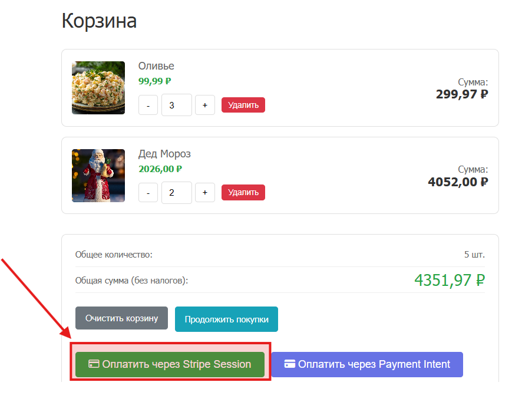
  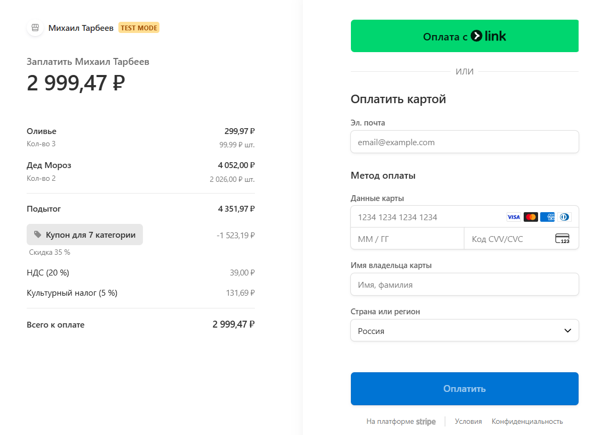
  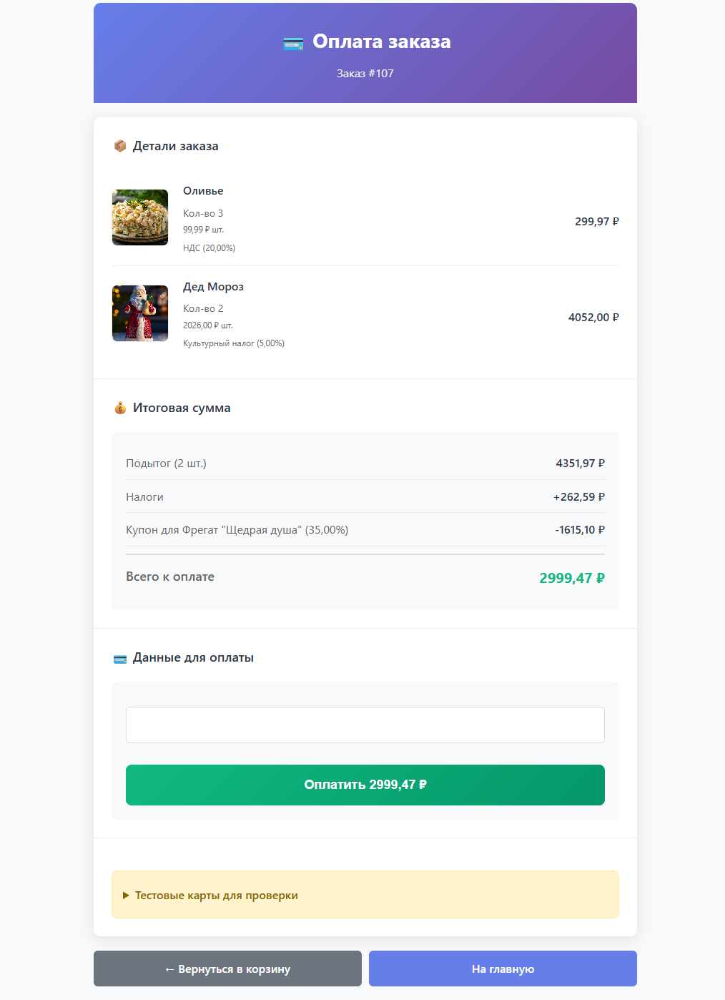
</div>


Проект реализует полноценную интеграцию с платёжной системой Stripe - современным решением для онлайн-платежей с детализированным API и бесплатным тестовым режимом. С помощью Python библиотеки stripe реализованы различные сценарии платежей, от простых однотоварных покупок до многотоварных заказов с налогами и скидками.

В рамках проекта реализованы два варианта проведения платежа, каждый из которых подходит для разных сценариев использования.


<a id="stripe-session"></a>
### Stripe Session


**Stripe Session** - это готовое решение для быстрого запуска платежей. Stripe предоставляет полностью настроенную страницу оплаты, что минимизирует код на стороне разработчика.

**Как работает:**
1. Пользователь нажимает "Оплатить через Stripe Session" в корзине
2. Сервер создает Stripe Checkout Session
3. Происходит автоматический редирект на страницу Stripe
4. После оплаты пользователь возвращается на сайт

**Endpoint:** `http://127.0.0.1:8000/buy/cart/`


**Пример создания сессии:**
```python
session = stripe.checkout.Session.create(
    line_items=[{
        'price_data': {
            'currency': 'usd',
            'product_data': {'name': 'Товар'},
            'unit_amount': 2000,
        },
        'quantity': 1,
        'tax_rates': [tax.stripe_tax_id]
    }],
    mode='payment',
    success_url='http://localhost:8000/success/',
    discounts=[{'coupon': 'coupon_id'}] if discount else None
)
```

<a id="stripe-payment-intent"></a>
### Stripe Payment Intent


**Stripe Payment Intent** - это гибкое решение для кастомных платежных форм. Позволяет встраивать форму оплаты непосредственно в интерфейс сайта.

**Особенности реализации:**
- Налоги рассчитываются на стороне Django 
- Скидки применяются перед созданием платежа
- Все данные валидируются на сервере

**Endpoint:** `http://127.0.0.1:8000/buy/payment-intent/`

**Пример создания Payment Intent:**
```python
payment_intent = stripe.PaymentIntent.create(
            amount=int(total_amount * 100),
            currency=currency.code.lower(),
            metadata={
                "user_id": str(request.user.id),
                "items_count": str(len(cart_items)),
                "base_price": str(base_price_total),
                "tax_amount": str(tax_amount_total),
                "discount": str(discount_amount),
                "rank": rank_name or "none",
            }
        )
```

<a id="структура-базы-данных"></a>
## 🗄️ Структура таблиц базы данных
Ниже представлена структура таблиц базы данных, которая используется в проекте.
<div align="center">
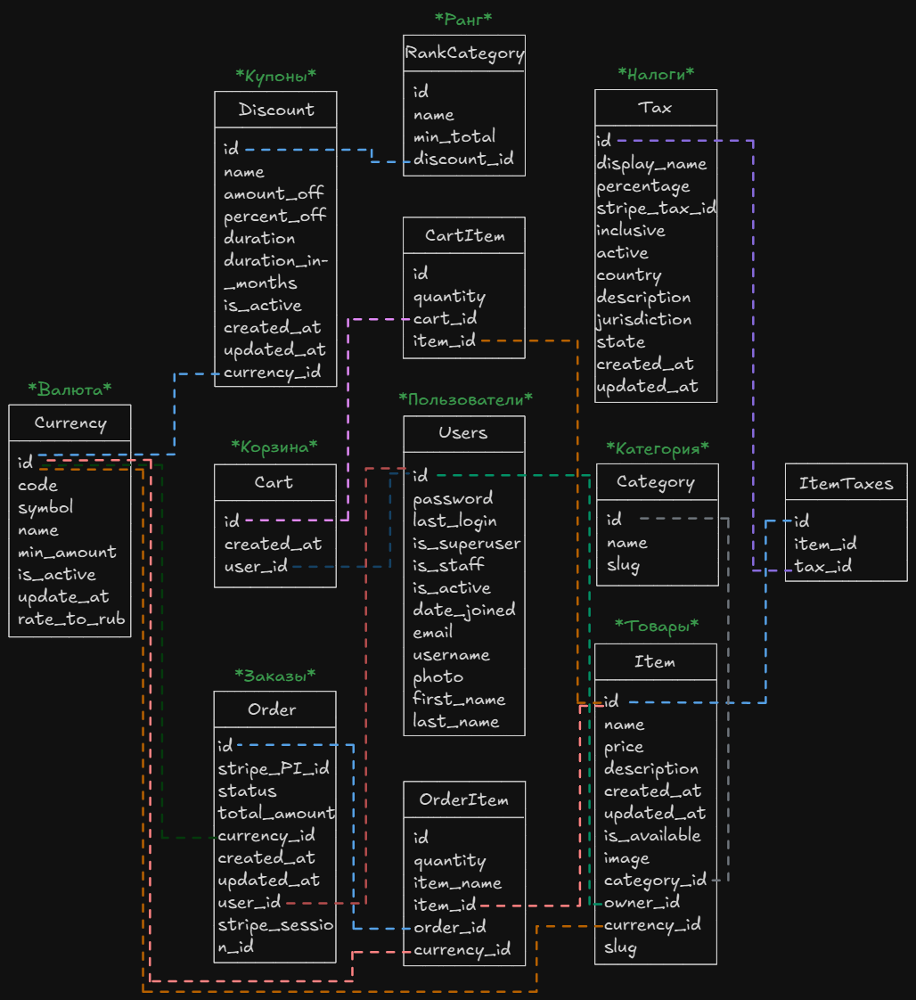
</div>

Проект использует реляционную базу данных PostgreSQL со следующей структурой:

| Модель | Назначение |
|--------|------------|
| **User** | Кастомная расширенная модель пользователя |
| **Tax** | Налоговые ставки |
| **Item** | Товары магазина |
| **Category** | Категории товаров | 
| **Discount** | Купоны на скидки | 
| **Cart** | Корзина покупок |
| **CartItem** | Связь товаров и корзины | 
| **Order** | Заказы пользователей |
| **OrderItem** | Товары в заказах | 
| **RankCategory** | Ранги пользователей |
| **Currency** | Валюты |

<a id="система-скидок"></a>
## 💰 Система скидок

<div align="center">
<p>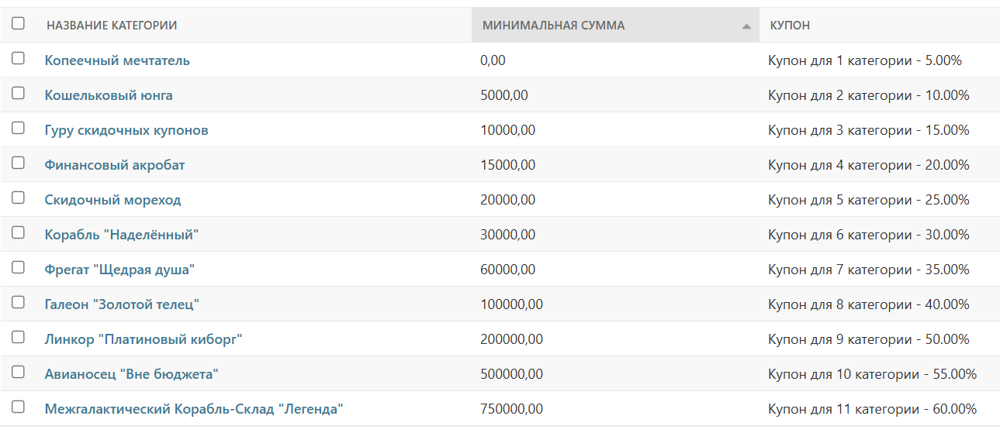</p>
<p>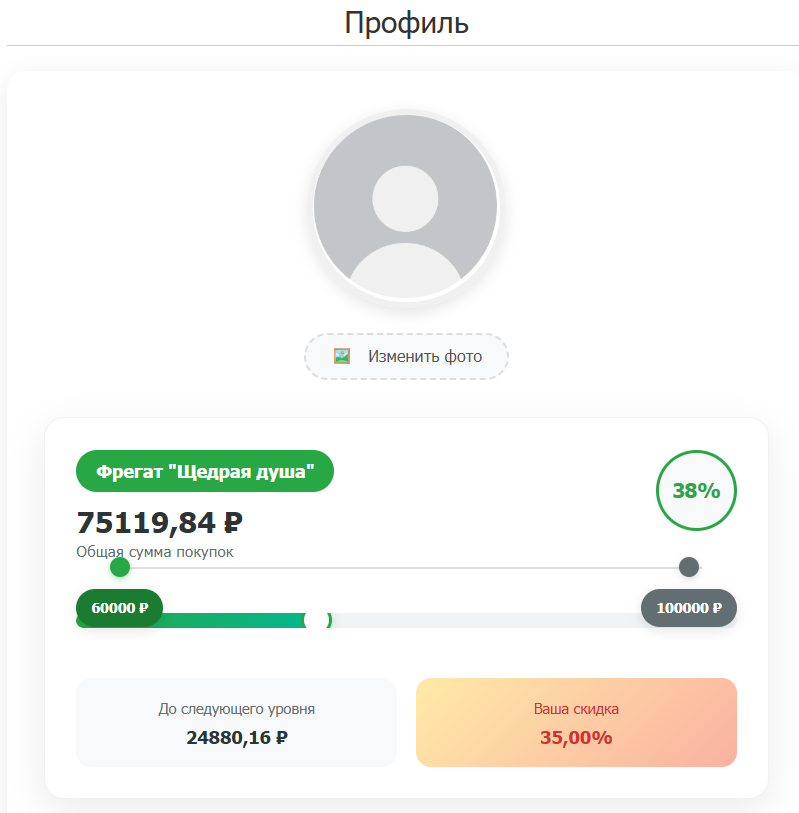</p>
</div>

На сайте реализована система скидок на основе рангов пользователей. Система автоматически рассчитывает скидку в зависимости от общей суммы, в рублях, потраченной пользователем.

**🏆 11 уровней рангов**

**Модели:**
- **Discount** - купоны Stripe с настройками срока действия
- **RankCategory** - ранги пользователей с привязкой к скидкам

**Особенности:**
- 💱 Автоматическая конвертация валют в рубли для расчёта ранга

Для этой цели у модели пользователя реализован метод:
```python
# Метод пользователя (модели Users)
def get_total_spent(self):
        """Сумма всех оплаченных заказов в рублях"""
        total_in_rubles = 0
        paid_orders = Order.objects.filter(user=self, status='Paid')

        for order in paid_orders:
            total_in_rubles += Currency.convert_amount_to_rubles(
                order.total_amount,
                order.currency.code
            )

        return round(total_in_rubles, 2)


# Метод модели валюты (Currency)
def convert_amount_to_rubles(cls, amount, currency_code):
    """Конвертировать сумму в рубли."""
    try:
        currency = cls.objects.get(code__iexact=currency_code)
        amount_in_main_unit = float(amount)
        if currency.code.lower() == 'rub':
            return amount_in_main_unit
        return amount_in_main_unit * float(currency.rate_to_rub)
    except cls.DoesNotExist:
        return 0
```

- 📊 Отображение прогресса до следующего ранга в профиле
- 🎫 Автоматическое применение купона при оформлении заказа
- 🔄 Синхронизация купонов между Django и Stripe

**Создание купонов через Admin панель:** `http://127.0.0.1:8000/admin/shop/discount/`

**API для проверки купонов:** `http://127.0.0.1:8000/api/v1/coupons/`

<a id="система-налогов"></a>
## 🏛️ Система налогов

Проект включает систему налогообложения. Налоги могут быть назначены на отдельные товары и автоматически рассчитываются при оформлении заказа.

**📋 Возможности системы налогов**
- Разные типы налогов: НДС, акцизы, экологические сборы
- Гибкие настройки: процентная ставка, включение в цену, активность
- Географическая привязка: страна, регион, юрисдикция
- Автоматическая синхронизация с Stripe Tax Rates

<div align="center">
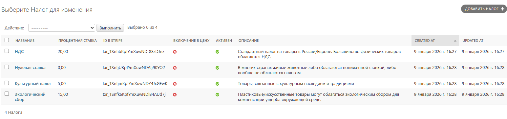
</div>

**Связь с товарами:**
```python
class Item(models.Model):
    # ...
    taxes = models.ManyToManyField(Tax, blank=True)  # Налоги товара
```

**Создание налогов через Admin панель:** `http://127.0.0.1:8000/admin/shop/tax/`

**API для проверки налогов:** `http://127.0.0.1:8000/api/v1/tax-rates/`


<a id="api-endpoints"></a>
## 🔌 API Endpoints

### 📱 Основные маршруты

| Метод | URL | Назначение |
|-------|-----|------------|
| GET | `http://127.0.0.1:8000/` | Главная страница со всеми товарами |
| GET | `http://127.0.0.1:8000/category/<slug>/` | Товары конкретной категории |
| GET | `http://127.0.0.1:8000/item/<slug>/` | Информация о товаре |
| GET/POST | `http://127.0.0.1:8000/item/<slug>/edit/` | Редактирование товара (только владельцу товара) |
| GET/POST | `http://127.0.0.1:8000/add_item/` | Добавление нового товара (любому пользователю) |
| GET/POST | `http://127.0.0.1:8000/delete_item/<slug>/` | Удаление товара (только владельцу товара) |
| GET/POST | `http://127.0.0.1:8000/users/register/` | Регистрация пользователя |
| GET/POST | `http://127.0.0.1:8000/users/login/` | Авторизация |
| GET | `http://127.0.0.1:8000/users/logout/` | Выход из системы |
| GET | `http://127.0.0.1:8000/users/profile/` | Профиль пользователя |

### 🛒 Корзина и оплата

| Метод | URL | Назначение |
|-------|-----|------------|
| GET | `http://127.0.0.1:8000/cart/` | Просмотр корзины |
| POST | `http://127.0.0.1:8000/cart/clear/` | Очистка корзины |
| POST | `http://127.0.0.1:8000/buy/cart/` | Оформление заказа через Stripe Session |
| POST | `http://127.0.0.1:8000/buy/payment-intent/` | Оформление через Stripe Payment Intent |
| POST | `http://127.0.0.1:8000/item/<slug>/add-to-cart/` | Добавление товара в корзину |
| POST | `http://127.0.0.1:8000/item/<slug>/remove-from-cart/` | Удаление товара из корзины |
| POST | `http://127.0.0.1:8000/item/<slug>/update-cart/` | Обновление количества товара |

### 💳 Платежи и результаты

| Метод | URL | Назначение |
|-------|-----|------------|
| GET | `http://127.0.0.1:8000/buy/item/<item_slug>/` | Покупка одного товара через Stripe Session |
| GET | `http://127.0.0.1:8000/create_session_success/` | Страница успешной оплаты (Session) |
| GET | `http://127.0.0.1:8000/payment-intent/success/` | Страница успешной оплаты (Payment Intent) |

### 🔧 API для отладки

| Метод | URL | Назначение |
|-------|-----|------------|
| GET | `http://127.0.0.1:8000/api/v1/tax-rates/` | Просмотр всех налогов Stripe |
| GET | `http://127.0.0.1:8000/api/v1/coupons/` | Просмотр всех купонов Stripe |

### 🛠️ Администрирование

| Метод | URL | Назначение |
|-------|-----|------------|
| GET | `http://127.0.0.1:8000/admin/` | Django Admin панель |
| GET | `http://localhost:8080/` | Adminer (управление БД) |

<a id="тестовые-данные"></a>
## 📊 Тестовые данные

При запуске проекта автоматически загружаются тестовые данные из файла `db.json`, включающие:

- 📦 Тестовые товаров
- 🏷️ Категории товаров
- 👥 Тестовые пользователи
- 💰 Валюты
- 🏛️ Кастомные налоги
- 🎫 Купоны на скидки
- 📊 Ранги пользователей

**Чтобы отключить загрузку тестовых данных,** закомментируйте соответствующую строку в `compose.yml`:
```yaml
command: >
  sh -c "python manage.py migrate &&
        # { python manage.py loaddata /app/www/siteshop/db.json 2>/dev/null || echo 'No fixtures found'; } &&
        python manage.py runserver 0.0.0.0:8000"
```

<a id="функционал"></a>
## 🎨 Функционал сайта

### 📱 Основные страницы

<table>
  <tr>
    <td align="center" valign="top">
      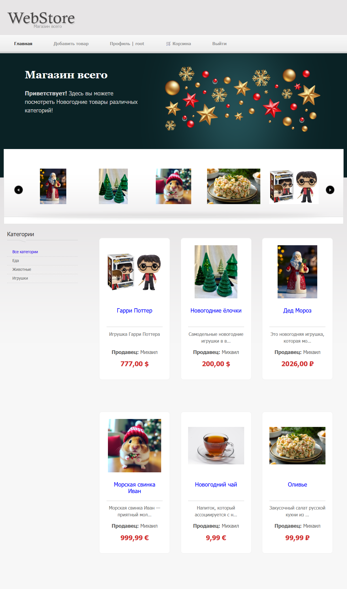
      <br>
      <b>🏠 Главная страница магазина</b>
    </td>
    <td align="center" valign="top">
      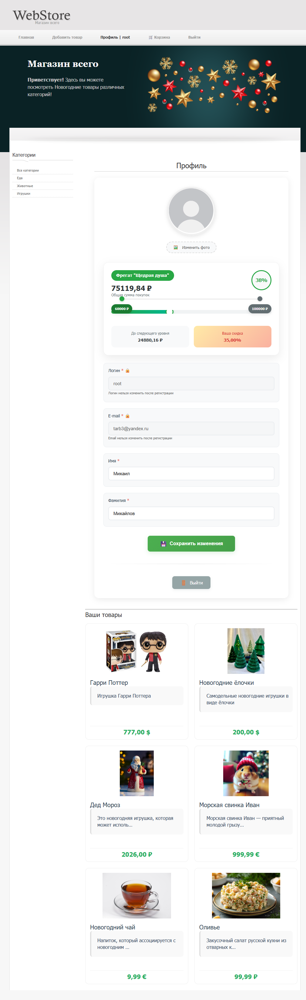
      <br>
      <b>👤 Профиль пользователя с прогрессом ранга</b>
    </td>
  </tr>
  <tr>
    <td align="center" valign="top">
      
      <br>
      <b>🛍️ Карточка товара с кнопкой покупки</b>
    </td>
    <td align="center" valign="top">
      
      <br>
      <b>🛒 Корзина с выбором способа оплаты</b>
    </td>
  </tr>
  <tr>
    <td align="center" valign="top">
      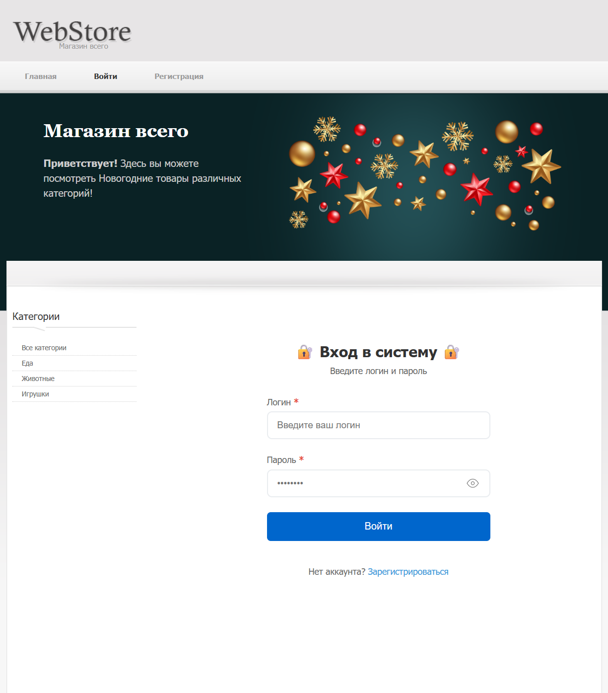
      <br>
      <b>🔑 Авторизация в системе</b>
    </td>
    <td align="center" valign="top">
      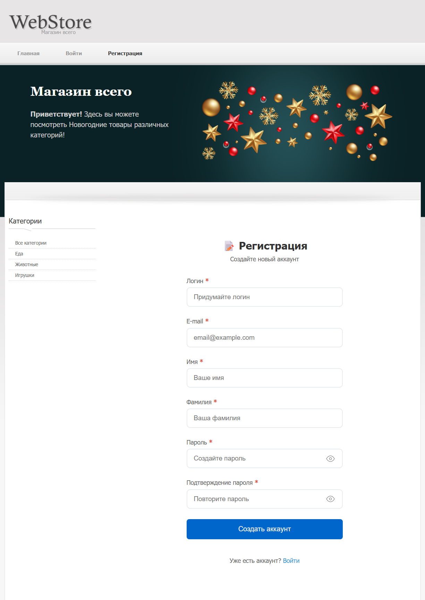
      <br>
      <b>📝 Регистрация нового пользователя</b>
    </td>
  </tr>
</table>


<a id="автор"></a>
## 👨‍💻 Автор

**Михаил Тарбеев**  
Python Developer

[](https://github.com/MihailTarbeev)  


⭐ **Спасибо Вам за интерес к моим проектам** ⭐